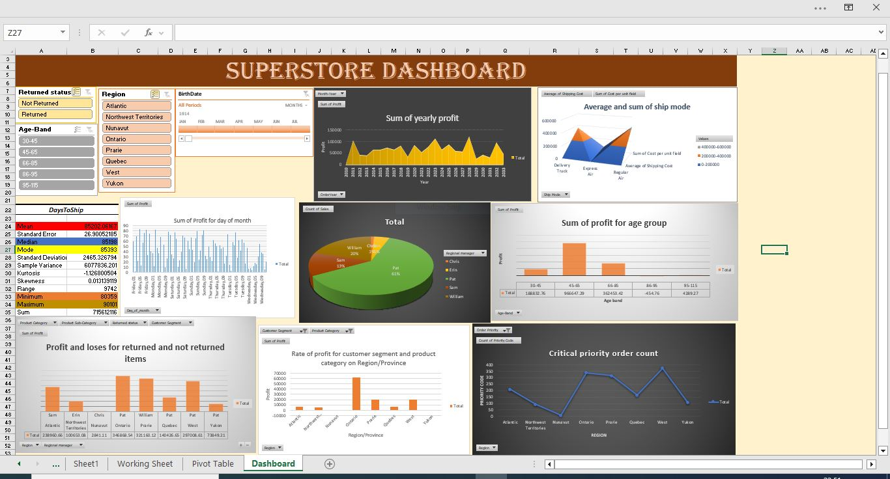
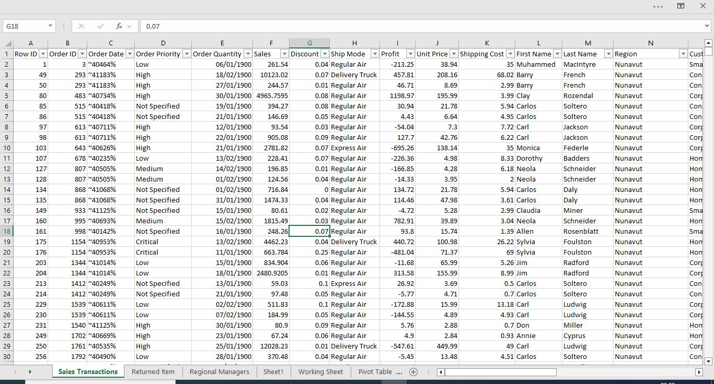
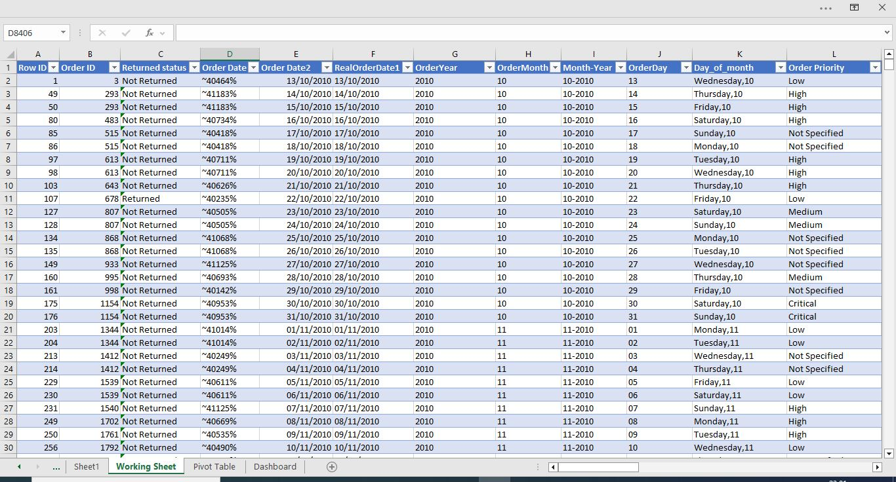
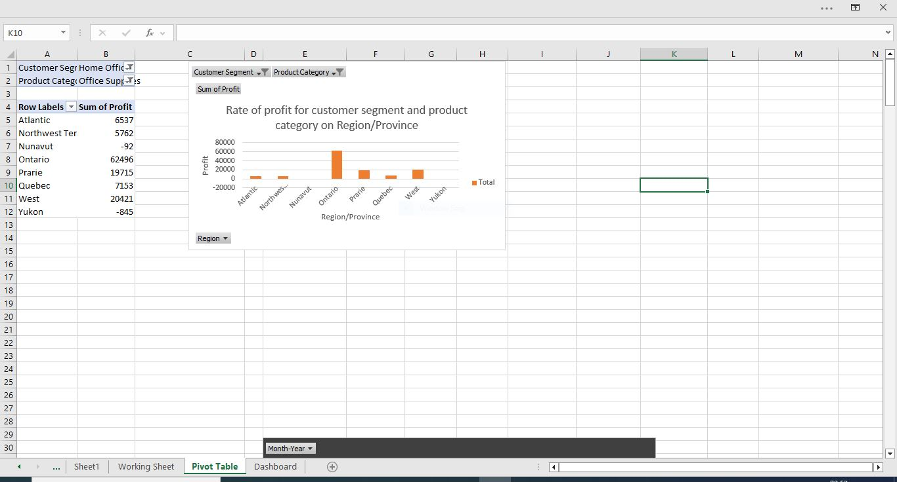
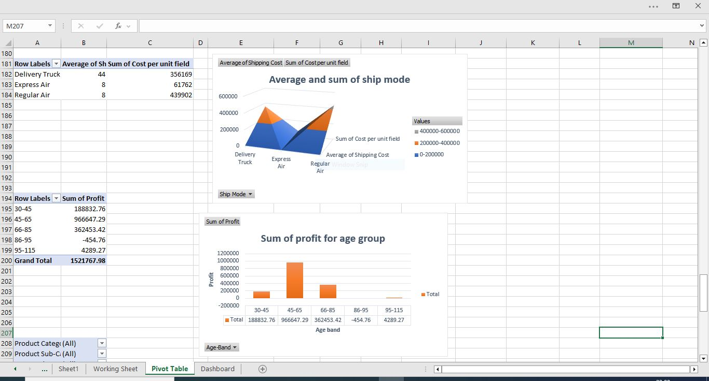
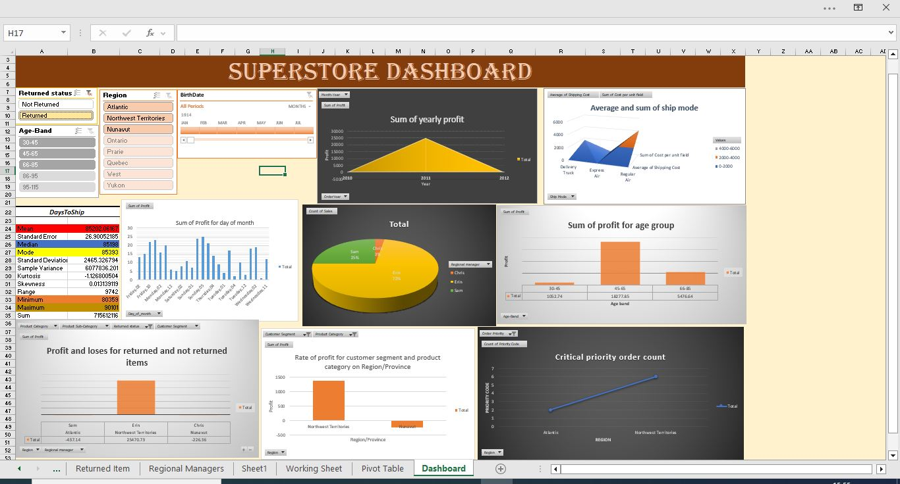

# Superstore Data Analysis

___

## Introduction
This Excel project focuses on an imaginary store, "Superstore," with the objective of analyzing various aspects of its operations. By examining data related to sales, shipping, customer demographics, and profitability, the project seeks to address crucial questions that can guide the business owner in making data-driven decisions. These decisions are intended to optimize the store's performance, refine its strategy, and ultimately strengthen the overall business structure. Through detailed analysis and visualizations, the project delivers actionable insights that can drive profitability, operational efficiency, and customer satisfaction.

**_Disclaimer_**: _All dataset or report do not represent any company, organization, institution or country. But just a dummy dataset to represent the capabilities of Excel_

## Problem Statement
1. Remove all erroneous and unclean values from the dataset.
2. Identify and replace missing values using suitable methods.
3. Verify and correct data formats to ensure consistency.
4. Create new variables (fields) from existing data to enhance the dataset.
5. Use lookup functions to pull data from another sheet and add a new column to the main dataset.
___

## Skills / Concept Demostrated
The following Excel features were learned and applied:
- Data cleaning
- Sorting and filtering data
- Utilizing Excel formulas, including combining functions like IF, ISNUMBER, and MATCH, along with advanced functions like CONCATENATE, DATEDIF, and LOOKUP
- Creating pivot tables
- Designing dashboards
- Implementing graphs and charts
- Using slicers and timelines for enhanced data analysis
___

## Data importing and cleaning
The data was imported in CSV/Text format, so Excel Power Query was used to transform it into a usable format before loading it into the Excel spreadsheet. Missing values were identified and replaced using the most suitable and appropriate methods.

With appropriate functions and formulas, the following fields were derived and created from the dataset
1.	RealOrderDate
2.	OrderDay
3.	OrderMonth
4.	 OrderYear 
5.	Month-Year 
6.	DayOfMonth 
7.	PriorityCode
8.	DaysToShip
9.	FullName
10.	Age
11.	AgeBand
12.	Regional manager
13.	Returned Status

___

## Analysis/Pivot table

This pivot table was used to find out the product category, region, Province and Customer Segment that is most profitable. Also, discriptive data analysis was used to analyze the Minimum, Maximum, Median, Mode and Mean (average) of "Daystoship" from the order date.
___

This pivot table and chart reveal which product category, region, province, and customer segment are the most profitable.
___

The first pivot table and chart display the most expensive shipping mode, along with the total shipping costs and the average cost per transaction across all sales. Meanwhile, the second pivot table and chart highlight the customer age groups driving profit and the commercial value (revenue/profit) associated with each age group.

The slicer and timeline provide an intuitive way to identify the specific product categories, regions, provinces, or customer segments impacted by "returned orders" during the Superstore analysis.  This will empower the store owner to make well-informed decisions and reward managers who have made significant contributions to the business's growth.
___
## Conclusion/Recommendation
Based on the analysis of the "Superstore" data, here are some recommendations to enhance the business:

- Focus on the most cost-effective shipping modes identified in the analysis. Reducing shipping costs can improve overall profitability.
- Prioritize marketing and sales strategies towards the most profitable product categories, regions, provinces, and customer segments.
- Use the insights from customer age groups and other demographic data to tailor marketing efforts and product offerings to different segments.
- Continuously monitor and clean data to ensure accuracy. Implement processes for regular data validation to maintain data integrity.
Implementing these recommendations can lead to improved decision-making, operational efficiency, and overall business growth.

